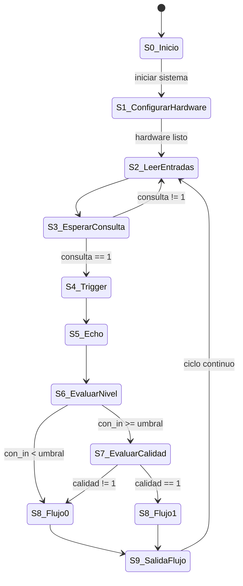
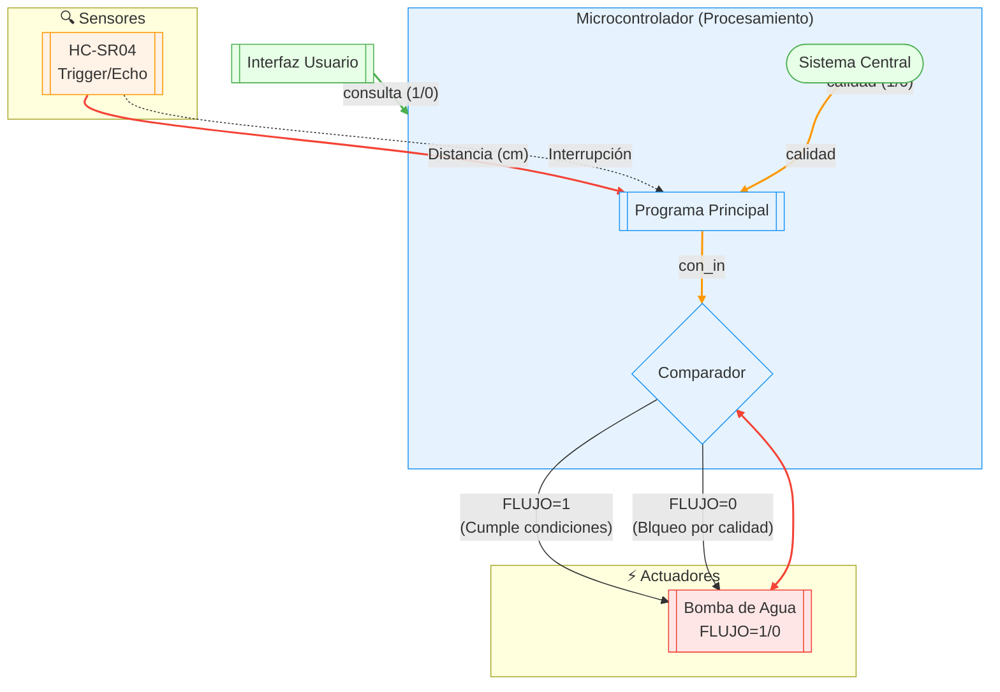

# Proyecto-Digital
Sensor de medida del agua 
En el presente repositorio se expondrá en que conssitió el proyecto realizado en la aignatura de electrónica digital, mostrando el paso a paso realizado

- Juan David Gomez 
- David Leonardo Botia
- Yuliana
  
Bienvenidos a nuestro repositorio del proyecto final de nuestra clase de electrónica digital de la Universidad Nacional de Colombia del semestre 2025-I, el cual consistía en el diseño y posterior implementación de un Sensor para la medicion de agua, realizando una versión digital de este mismo mediante el uso de sensores ultrasónicos, FPGA y ESP32.
##
Objetivo general 

- Diseñar e implementar un sistema de medición de nivel de agua en tiempo real, utilizando un sensor ultrasónico HC-SR04, un microcontrolador ESP32 para la adquisición y transmisión de datos, y una FPGA para el procesamiento y control de señales digitales, con el fin de generar un prototipo funcional y escalable para aplicaciones de monitoreo

##
Objetivos especificos

- Diseñar el sistema de adquisición de datos del nivel de agua mediante el sensor ultrasónico HC-SR04, acoplado al ESP32 para capturar la distancia entre el sensor y la superficie del agua.
- Implementar el procesamiento digital de señales en la FPGA para gestionar el control del pulso de disparo (trigger) y la lectura precisa del pulso de eco del sensor HC-SR04.
- Integrar una interfaz de usuario o un canal de salida ( Bluetooth usando el ESP32) para mostrar el nivel de agua en una aplicación o dashboard.
- Verificar y validar el sistema completo mediante simulaciones y pruebas físicas del prototipo en diferentes niveles de agua para asegurar la precisión y confiabilidad del sistema.
- Documentar todo el proceso de desarrollo, incluyendo requerimientos funcionales, diagramas ASM, códigos HDL y de microcontrolador, bitácoras de pruebas, y resultados experimentales.

##

El monitoreo del nivel de agua es esencial para la automatización en riegos, acueductos, y control de fluidos en general. Este proyecto busca integrar tecnologías digitales con procesamiento distribuido para ofrecer una solución educativa y funcional para este tipo de monitoreo.

La arquitectura implementa una solución SoC híbrida, donde la **FPGA realiza la temporización de señales críticas**, y el **ESP32 actúa como nodo de comunicación inteligente**, gestionando el envío de datos por red.
##
**REQUERMIENTOS DEL PROYECTO**
##
**✅ Requerimientos Funcionales**

**🧭 Medición de distancia usando el sensor ultrasónico**
   - El sensor ultrasónico HC-SR04 mide la distancia al nivel de agua mediante pulsos de eco.
     
**⚙️Procesamiento digital de la señal de tiempo de retorno en una FPGA.**
   - La FPGA calcula el tiempo del eco y convierte el dato en una señal digital interpretable.
     
**💧 Cálculo del nivel de agua y generación de alerta si es bajo o alto.**
   - Se transforma la distancia en una medida de nivel y se compara con umbrales definidos.
     
**📡 Transmisión de datos desde la FPGA al ESP32 mediante UART.**
   - La FPGA envía el dato procesado al ESP32 mediante comunicación serial.
     
**🌐 Comunicación del dato medido a un servidor o aplicación.**
   - El ESP32 transmite el nivel de agua a una aplicación via bluetooth (ESP32)
     
**🧪 Sistema implementado**
   - Se revisa el hardware y se verifica  mediante simulación.

##
**✅ Requerimientos No Funcionales**

**⏱️ Tiempo de respuesta adecuado**
- El sistema debe responder a los cambios en el nivel de agua..

**🔁 Confiabilidad operativa**
- El sistema debe funcionar de manera continua y precisa sin fallas durante largos periodos.

**📈 Simulación funcional**
- Compatible con simuladores como Icarus Verilog + GTKWave.
  
**📝 Código documentado**
- Cada módulo está comentado para facilitar su comprensión y mantenimiento.
##
***Módulos Verilog**
| Archivo               | Función                                                                 |
|-----------------------|-------------------------------------------------------------------------|
| `SOC.v`               |  Módulo principal del SoC, conecta CPU, memoria y periféricos.          |
| `top_tb.v`            |  Testbenches para simular comportamiento                                |
| `address_decoder.v`   |  Decodifica direcciones para acceso a memoria y periféricos.            |
| `bench_quark.v`       |  Banco de pruebas para la CPU (núcleo tipo Quark).                      |
| `chip_select.v`       |  Controla la habilitación de módulos según la dirección.                |  
| `uart_tx.v`           |  Envía datos de estado por UART a microcontrolador o dispotivo.         | 
|   mult.v	            |  Módulo principal del multiplicador.                                    |

##
##
Diagrama ASM/ Maquina de estados/ diagramas funcionales:

**Diagrama general**

**Diagrama del sensor**

**Maquinas de Estado**

**MAPAS DIAGRAMA GENERAL**

# Máquina de Estados Finita (FSM) del Sistema de Control de Flujo

Este diagrama representa el flujo de control del sistema de medición de nivel de agua y activación de bomba, basado en el sensor ultrasónico HC-SR04 y una señal de calidad externa.

---

### Estados:

- **S0_Inicio**: Estado inicial del sistema.
- **S1_ConfigurarHardware**: Configuración del hardware.
- **S2_LeerEntradas**: Recolección de datos de entrada.
- **S3_EsperarConsulta**: Espera de señal desde el sistema central.
- **S4_Trigger**: Enviar pulso de disparo al sensor HC-SR04.
- **S5_Echo**: Lectura de tiempo de respuesta del sensor.
- **S6_EvaluarNivel**: Comparación entre "con_in" y "umbral".
- **S7_EvaluarCalidad**: Verifica si la calidad del agua es aceptable.
- **S8_Flujo0**: Desactivar bomba (flujo = 0).
- **S8_Flujo1**: Activar bomba (flujo = 1).
- **S9_SalidaFlujo**: Salida de control de flujo.

---

Este FSM se puede implementar en microcontroladores como Arduino o ESP32 y forma parte de sistemas automatizados de control de nivel de agua.

# ⚙️ Diagrama Funcional del Sistema de Control de Agua

**Notas de implementación:**
1. GitHub no soporta el elemento `legend->` nativo en Mermaid
2. Usamos `%%` para comentarios (no afectan el renderizado)
3. Los `subgraph` deben tener nombres SIN espacios (usar guiones bajos)
4. Los nodos deben definirse antes de conectarse

**MAPAS DEL CONTROL DEL AGUA**

# Máquina de Estados Finita (FSM) del Sistema de Control de Flujo

Este diagrama representa el flujo de control del sistema de medición de nivel de agua y activación de bomba, basado en el sensor ultrasónico HC-SR04 y una señal de calidad externa.

---

### Estados:

- **S0_Inicio**: Estado inicial del sistema.
- **S1_ConfigurarHardware**: Configuración del hardware.
- **S2_LeerEntradas**: Recolección de datos de entrada.
- **S3_EsperarConsulta**: Espera de señal desde el sistema central.
- **S4_Trigger**: Enviar pulso de disparo al sensor HC-SR04.
- **S5_Echo**: Lectura de tiempo de respuesta del sensor.
- **S6_EvaluarNivel**: Comparación entre "con_in" y "umbral".
- **S7_EvaluarCalidad**: Verifica si la calidad del agua es aceptable.
- **S8_Flujo0**: Desactivar bomba (flujo = 0).
- **S8_Flujo1**: Activar bomba (flujo = 1).
- **S9_SalidaFlujo**: Salida de control de flujo.

---

Este FSM se puede implementar en microcontroladores como Arduino o ESP32 y forma parte de sistemas automatizados de control de nivel de agua.

##
Simulación con testbenches
##
Diagrama RTL del SoC y su mòdulo:
##
Simulaciones:
##
Video simulacion:
##
Logs de make log-prn, make log-syn diagramas de flujo 
##
¿Còmo interactùa con entornos externos?
##
Video del proyecto
##

# Diagrama Funcional del Sistema de Control de Nivel de Agua

---

### Componentes:

- **Configuración**: Inicializa el sistema y los registros.
- **GenerarTrigger**: Envía el pulso ultrasónico desde el sensor HC-SR04.
- **EsperaEcho**: Monitorea la señal de Echo del HC-SR04.
- **CapturaEcho**: Mide el tiempo del pulso de retorno.
- **CalcularDistancia**: Calcula la distancia usando el tiempo medido.
- **Resultado**: Guarda o muestra la distancia medida.
- **Error**: Indica una falla por falta de respuesta (Timeout).
- **TriggerON**: Pone Trigger = 1, activando el pulso ultrasónico.
- **ConteoON**: Cuenta ciclos para controlar la duración del Trigger.
- **TriggerOFF**: Pone Trigger = 0, finalizando el pulso.
- **Escucha**: Espera un flanco de subida en Echo para comenzar la medición.
- **Timeout**: Indica que no se recibió Echo a tiempo; salta a error.
- **MedirTiempo**: Mide cuánto tiempo permanece Echo en alto.
- **FinCaptura**: Detecta flanco de bajada en Echo; finaliza el conteo.
- **CalcularDistancia**: Aplica la fórmula de distancia:
     distancia = (con_in × 34300) / (2 × 25e6)

